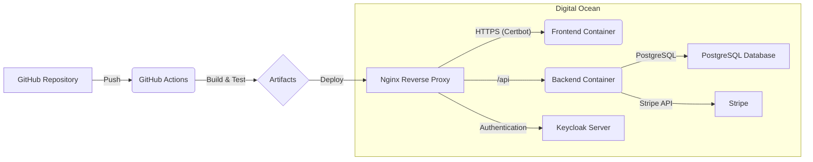

<div align="center">
  <br />
  
  <h1><a href="https://teachly.store">Teachly Marketplace</a> 🚀</h1>
  <p>
    A Fullstack Learning Project for Teachers! 🧑‍🏫📚👩‍🏫
  </p>
</div>

---

👋 Welcome to the **TeachMe Marketplace** repository! This project was built with passion and a desire to learn the intricacies of modern fullstack development. It's a platform where educators can share and monetize their valuable teaching resources. Dive in to explore the technologies and architecture that power this marketplace!

[](https://github.com/Davidcode2/teachme/actions/workflows/main.yml)

---

## ✨ Key Features

* **Teacher Portal:** Effortlessly upload and manage your teaching materials (PDFs). 📤
* **Browse & Discover:** Explore a wide range of resources shared by fellow educators. 🔍
* **Secure Payments:** Seamless and secure transactions powered by Stripe. 💳
* **Robust Authentication:** Secure user management with Keycloak. 🔑
* **Scalable Backend:** Built with Nest.js for a maintainable and efficient server. ⚙️
* **Modern Frontend:** Engaging user interface developed with React and TypeScript. ⚛️
* **Continuous Deployment:** Automated deployments with GitHub Actions. ⚙️➡️☁️

---

## 🛠️ Tech Stack - The Building Blocks

This project leverages a powerful combination of technologies to deliver a seamless user experience and a robust backend.

### 💻 Frontend

* **React:** A popular JavaScript library for building user interfaces. 
* **TypeScript:** Adds static typing to JavaScript, enhancing code quality and maintainability. 
* **Zustand:** For efficient state management in the React application. 🔄
* **Tailwindcss:** For styling React components with ease and maintainability.💅
* **Fetch:** For making HTTP requests to the backend API. 📡

### ⚙️ Backend

* **Nest.js:** A progressive Node.js framework for building efficient and scalable server-side applications. 
* **TypeScript:** Ensuring type safety and improved developer experience on the backend as well. 
* **PostgreSQL:** A powerful, open-source relational database. 
* **TypeORM:** An ORM for Node.js that supports various databases, including PostgreSQL. 🐘
* **Stripe:** For handling secure payment processing. 💰
* **Keycloak:** An open-source identity and access management solution for secure authentication. 🛡️

### ☁️ Deployment & Infrastructure

* **Digital Ocean:** The cloud platform hosting the application. 🌊
* **Docker Compose:** For defining and managing multi-container Docker applications. 🐳
* **Nginx:** A high-performance reverse proxy server. ⚙️
* **Certbot:** For automatically obtaining and installing TLS/SSL certificates, enabling HTTPS. 🔒
* **GitHub Actions:** For automating the build, test, and deployment pipelines (Continuous Deployment). 

---

## 🚀 Deployment - Taking it Live!

The TeachMe Marketplace is deployed on Digital Ocean and orchestrated using Docker Compose. Here's a simplified overview of the deployment pipeline:

1.  **Code Changes:** Developers push their code changes to the GitHub repository. ✍️
2.  **GitHub Actions Workflow:** Upon a push to the main branch, a GitHub Actions workflow is triggered. ⚙️
3.  **Build & Test:** The workflow builds the frontend and backend applications and runs automated tests. ✅
4.  **Docker Image Creation:** Docker images for the frontend and backend are built. 🐳
5.  **Deployment to Digital Ocean:** The updated Docker images are pushed to the Digital Ocean server. ☁️
6.  **Docker Compose Up:** Docker Compose on the server pulls the latest images and restarts the application containers. 🔄

### ⚙️ Infrastructure Overview



-----

## 📚 Learning Journey

This project is primarily a learning experience focused on mastering the following concepts:

  * Building a fullstack application with React and Nest.js.
  * Implementing secure user authentication using Keycloak.
  * Integrating a payment gateway (Stripe) for online transactions.
  * Setting up and managing a PostgreSQL database.
  * Containerizing applications with Docker and Docker Compose.
  * Deploying and managing applications on Digital Ocean.
  * Automating the deployment process using GitHub Actions for Continuous Deployment.
  * Configuring Nginx as a reverse proxy and securing it with HTTPS using Certbot.

-----

## 🛠️ Local Development - Get Your Hands Dirty\!

Want to run TeachMe Marketplace on your local machine? Follow these steps:

1.  **Clone the Repository:**

    ```bash
    git clone [https://github.com/Davidcode2/teachme.git](https://github.com/Davidcode2/teachme.git)
    cd teachme
    ```

2.  **Install Dependencies:**

    ```bash
    cd fe
    npm install
    cd ../be
    npm install
    cd ../
    ```

3.  **Set up Environment Variables:**

      * Create a `.env` file in the `be` directory.
      * Make sure to configure your PostgreSQL database connection, Stripe API keys, Keycloak settings, and other necessary environment variables.

4.  **Start the Development Servers:**

    ```bash
    # Start the backend
    cd be
    npm run start:dev

    # In a new terminal, start the frontend
    cd ../fe
    npm run dev
    ```

5.  **Access the Application:** Open your browser and navigate to `http://localhost:5137` (or the port specified in your client `.env` file).

**Note:** You'll need to have Docker, Node.js, npm (or yarn), and PostgreSQL installed on your local machine. You might also need to run a local Keycloak instance for full authentication functionality.

##  🐳  Running with Docker 

1. run `docker compose build && docker compose up -d`

-----

## 🙏 Acknowledgements

A big thank you to the open-source community and the creators of the amazing technologies used in this project\! Your contributions have made this learning journey possible. 🙌

-----

## 📜 License

This project is open-source and licensed under the [MIT License](https://www.google.com/search?q=LICENSE).

-----

<div align="center">
  
<p>
Made with ❤️ by <a href="https://github.com/Davidcode2">Davidcode2</a> Germany 🇩🇪.
</p>
</div>
