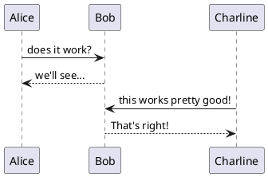
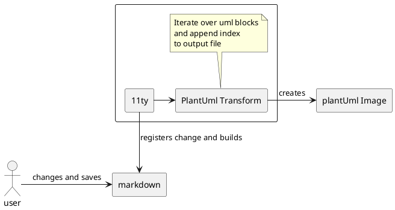

I'm trying to understand some of the following: Nginx, networking, docker
networks, TLS, Client Server communication, server to server communication..
Playing around with PlantUML might help with that. It also has the nice side effect
of giving me some practice with PlantUML.

@startuml

skinparam componentStyle rectangle

rectangle Server {
  rectangle Nginx {
    component "Backend"
    component "Keycloak"
  }
}

rectangle "Public Internet" as public_internet

[Browser] -> [Backend] : request
[Browser] --> [Keycloak] : authenticate
[Backend] --> public_internet
public_internet --> [Keycloak] : userinfo

note left of public_internet 
  I need to send the request to 
  keycloak via the public internet 
  because I do not have 
  internal TLS set up
  in my docker network 
end note

@enduml

I learned that Nginx does not encrypt the packet as it is shown below. Instead
a TLS handshake is carried out between the Backend (which is the client in this case) and Keycloak, which 
acts as the server. For this the client initiates a connection request to the server.

After completing the TCP handshake, the TLS handshake is carried out. This
involves the server sending its certificate. The certificate contains the
public key. 

It just so happens that in this special case the certificate is the
same one that the backend also uses when requests are made to it. 

The client in this case encrypts a pre-master secret with the servers public key and
sends it to the server. I guess this constitutes a key exchange. We have the
classic scenario here, where asymmetric encryption is used for the key
exchange, and afterwards the encryption is symmetric with the master key which
was generated by the client. 

To recap: The client uses the servers public key which was sent within the
certificate. This public key is used by the client to encrypt a pre-master
secret which it has just generated. This means that at this point only the
client knows the pre-master secret. After it has been encrypted even the client
cannot decrypt it again. For this the private key would be necessary. The
server has the private key. This private key and the public key constitutes a
key pair. So when the server receives the encrypted pre-master secret, it can
decrypt it.

The client and the server, each on its own will use the decrypted pre-master
secret to derive a master secret. For this, previously exchanged random numbers
are used.

The below diagram will have to be updated with this new found understanding.

@startuml

!pragma teoz true
skinparam BoxPadding 5
skinparam ParticipantPadding 5

participant "Public Internet" order 50

Browser -> Nginx : GET api/cart

note left Nginx: Nginx terminates TLS 

Nginx -> Backend ++ : proxy_pass :3000
Backend -> Nginx : GET realm/userinfo
note left Backend: Initiate encrypted transfer
Nginx -> "Public Internet" : GET realm/userinfo
"Public Internet" --> Nginx : :443
Nginx -> Keycloak ++ : proxy_pass :8080
Keycloak --> Nginx -- : userinfo
Nginx -> "Public Internet" : 168.290.592.104
"Public Internet" --> Nginx
Nginx -> Backend : proxy_pass :3000
Backend -> Backend : authenticate
Backend --> Nginx -- 
Nginx --> Browser : response

box "Server" #c1cde6

  box "Docker Network"

  participant Nginx
  participant Backend
  participant Keycloak
  
  end box

end box

@enduml

One issue I have with creating plantUML diagrams is that I build them in my
notes directory - separate from my blog - and copy the images over when done.
This is a bit of a hassle and needs to be optimized. Thus I will put my
plantUML code right into the blog posts. I will write some logic which checks
for the `@startuml` and `@enduml` tags. When these show up, I will have a tab
section where the viewer can toggle between the code and the image. And because
I am lazy and I have other things to do, I'll let Gemini do that for me.

Let's see how it does:



Let me put another UML Diagram right here: 

@startuml

[component1] --> [componentX]
[component1] --> [component2]
[component2] -> [component3]

@enduml

Now I have a concrete use case for a plantUML diagram relating to this blog.
Currently, the transform code which parses each blog post and checks whether it
can find plantUML code blocks will create an image for each code block it
finds, every time something changes - anywhere in the code. This is a problem.
My output folder gets spammed with all these duplicate images. Also, if a
diagram actually changes, the old version of the image will just stay there.

A first point of consideration would be that the image generation shouldn't run  
on any change in the code base.

Second I need to figure out how to delete old versions when the diagram code
changed.

The goal is to have only one image for each diagram in a post at any given time.

Let's draw it up: 



For the file names of the generated PNGs I use the same convention as plantUML
does. This means that when I manually run plantUML, it will just update the
existing images instead of creating new ones.

Turns out my reasoning above was flawed. I don't even have the problem of
having to delete old versions of the images. I just override the one image file
I create initially.

So now as I researched the markdown capabilities in 11ty, I came across
syntax highlighting. Let's test it out with an example of the code 
used for the transform.

```javascript
function getUmlBlocks(content) {
  // these are blocks which are directly in the markdown content
  const umlBlockRegex = /^<p>@startuml<\/p>\n(?:.*\n)+?^<p>@enduml<\/p>$/gm;
  // these are blocks enclosed in ```plantuml code blocks
  const codeBlockPlantumlRegex = /^<pre><code class="language-plantuml">@startuml\n(?:.*\n)+?^@enduml\n<\/code><\/pre>$/gm;

  const umlBlocks = content.match(umlBlockRegex);
  const codeBlocks = content.match(codeBlockPlantumlRegex);
  if (!umlBlocks) {
    return null;
  }
  const allPlantUmlBlocks = umlBlocks.concat(codeBlocks);
  return allPlantUmlBlocks;
}
```

