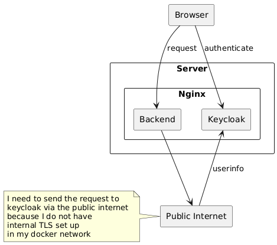
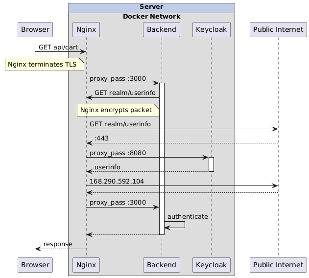

I'm trying to understand some of the following: Nginx, networking, docker
networks, TLS, Client Server communication, server to server communication..
Playing around with PlantUML might help with that. It also has the nice side effect
of giving me some practice with PlantUML.

I learned that Nginx does not encrypt the packet as it is shown below. Instead
a TLS handshake is carried out between the Backend (which is the client in this case) and Keycloak, which 
acts as the server. For this the client initiates a connection request to the server.

After completing the TCP handshake, the TLS handshake is carried out. This
involves the server sending its certificate. The certificate contains the
public key. 

It just so happens that in this special case the certificate is the
same one that the backend also uses when requests are made to it. 

The client in this case encrypts a pre-master secret with the servers public key and
sends it to the server. I guess this constitutes a key exchange. We have the
classic scenario here, where asymmetric encryption is used for the key
exchange, and afterwards the encryption is symmetric with the master key which
was generated by the client. 

To recap: The client uses the servers public key which was sent within the
certificate. This public key is used by the client to encrypt a pre-master
secret which it has just generated. This means that at this point only the
client knows the pre-master secret. After it has been encrypted even the client
cannot decrypt it again. For this the private key would be necessary. The
server has the private key. This private key and the public key constitutes a
key pair. So when the server receives the encrypted pre-master secret, it can
decrypt it.

The client and the server, each on its own will use the decrypted pre-master
secret to derive a master secret. For this, previously exchanged random numbers
are used.

The below diagram will have to be updated with this new found understanding.

One issue I have with creating plantUML diagrams is that I build them in my
notes directory - seperate from my blog - and copy the images over when done.
This is a bit of a hassle and needs to be optimized. Thus I will put my
plantUML code right into the blog posts. I will write some logic which checks
for the `@startuml` and `@enduml` tags. When these show up, I will have a tab
section where the viewer can toggle between the code and the image. And because
I am lazy and I have other things to do, I'll let Gemini do that for me.

Let's see how it does:

@startuml

Alice -> Bob : does it work?
Bob --> Alice : we'll see...

Charline -> Bob : this works pretty good!
Bob --> Charline : That's right!

@enduml

Let me put another Uml Diagram right here: 

@startuml

[component1] --> [componentX]
[component1] --> [component2]
[component2] -> [component3]

@enduml

