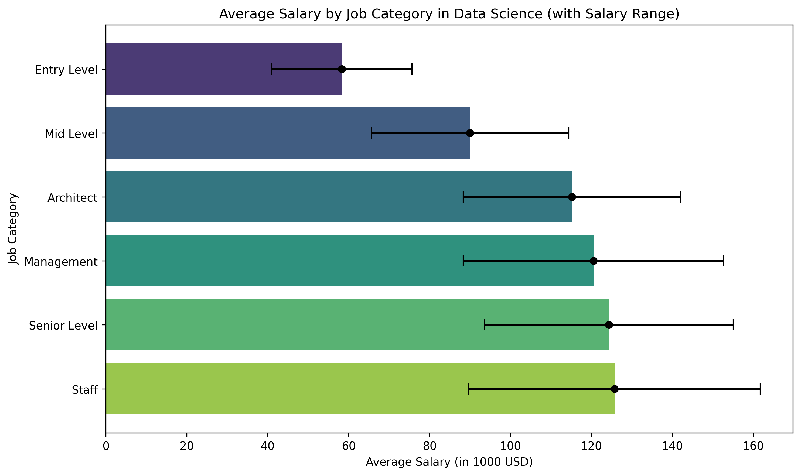
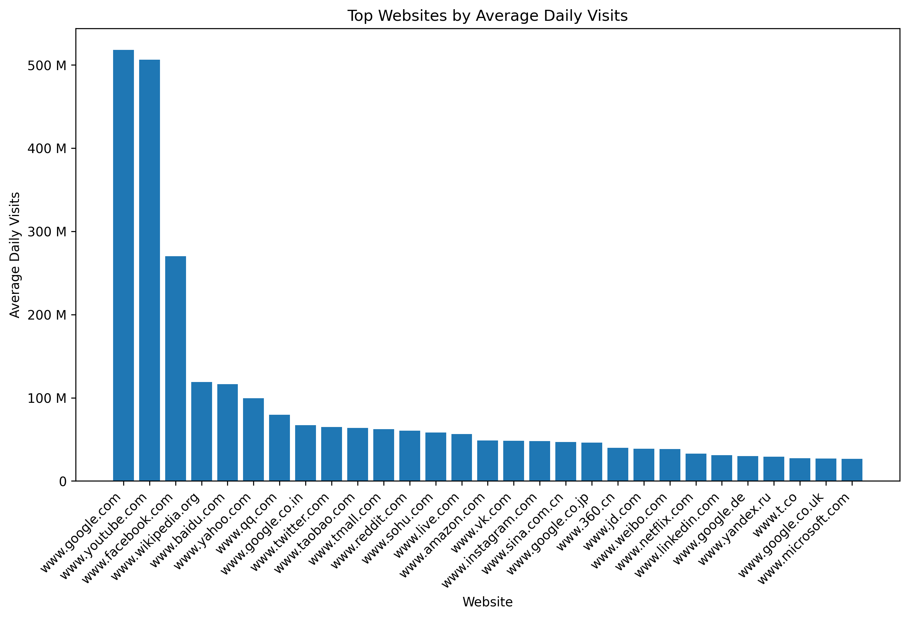

This graph was created in python with `matplotlib` and `seaborn`. The logic is
98% courtesy of ChatGPT. The data is from
[Kaggle](https://www.kaggle.com/datasets/nikhilbhathi/data-scientist-salary-us-glassdoor).
It's salary data from 2021. For more info see the dataset in the link.

The reason I started playing around with data visualization was my reading
about long tails in "The Psychology of Money" by Morgan Housel. I thought it
would be nice to have that visualized. So here goes a chart of a long tail.
The data is from [here](https://www.kaggle.com/datasets/bpali26/popular-websites-across-the-globe/data).

Morgan Housel describes how in finance, most of the earnings come from a
diminishingly small number of assets. Most assets will fail and that's fine.
It's enough to have a few or even only one asset that drives the entire gains.

